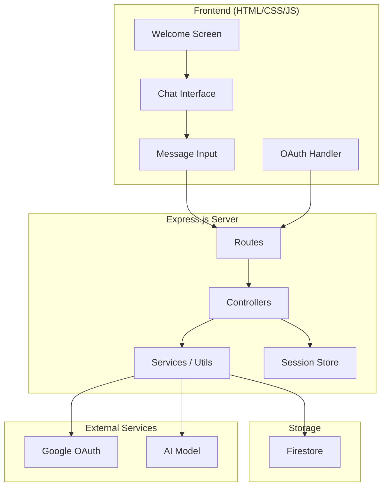
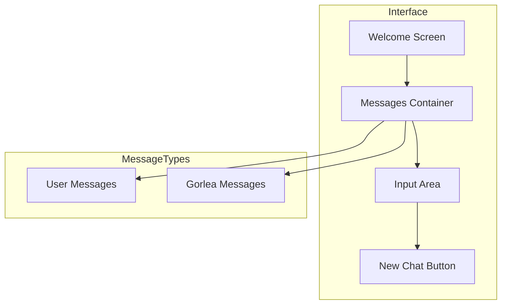
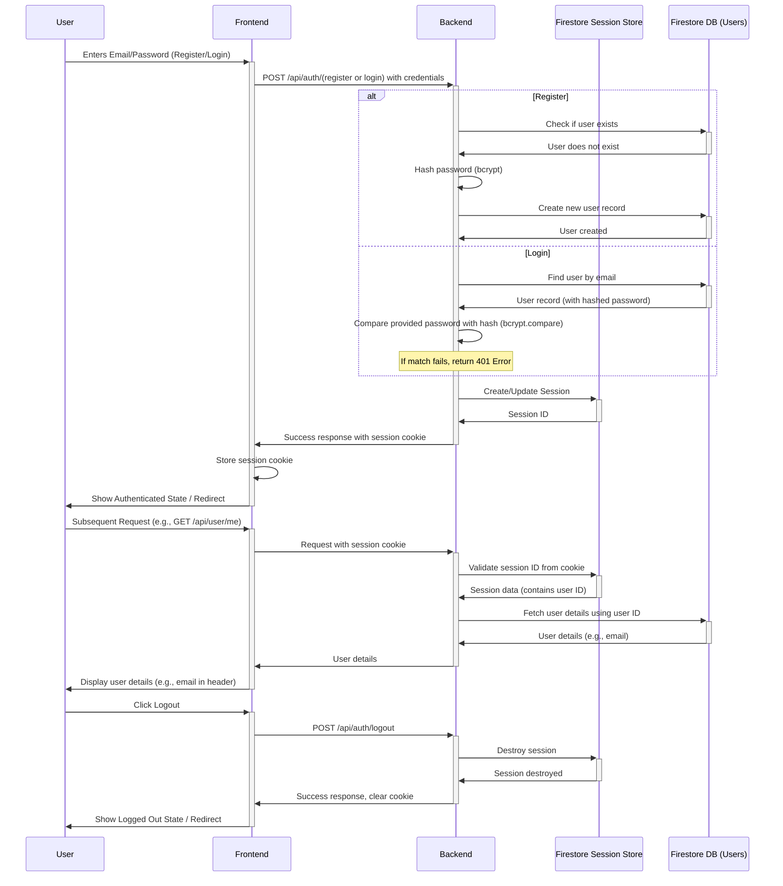
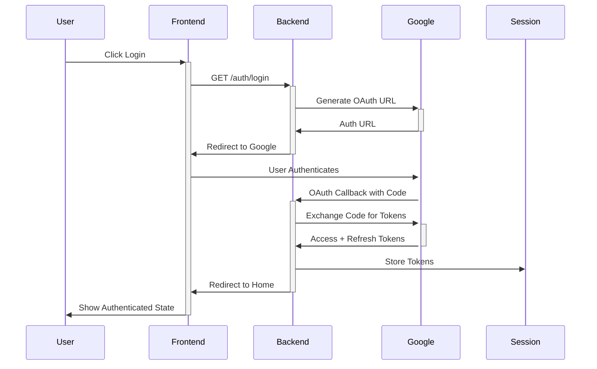
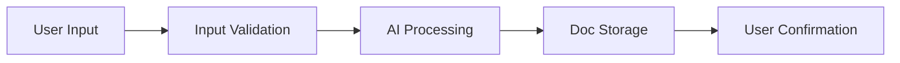
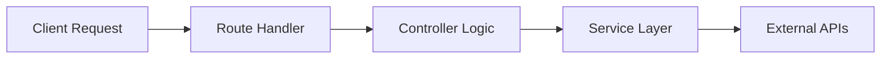
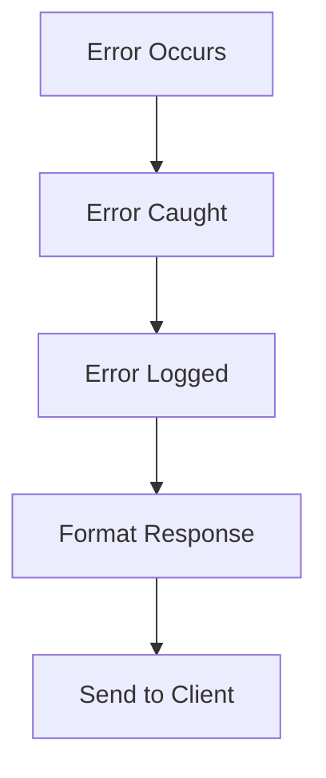

# 🏗 System Patterns: Gorlea Notes

## System Architecture



## Frontend Patterns

### 1. UI Components


### 2. Frontend State Management
- **Chat History:** Uses browser `localStorage` to persist the current chat message list across page refreshes. State is cleared via the "New Chat" button.
- **Application State:** Other state (e.g., `lastRewrittenNote`) is currently ephemeral and resets on refresh.

### 3. Message Styling Pattern
- Consistent dark theme (#1E1E2E)
- Gold accents for visual hierarchy
- Right-aligned user messages
- Left-aligned Gorlea messages
- Smooth animations and transitions

### 3. Button Styling Pattern

- **(April 6, 2025)** Unified `.gorlea-button` style created in `main.css` for header buttons across chat, docs list, and editor pages.
  - **Style:** Gold background, dark text, rounded rectangle (8px radius), consistent height (2.2rem), padding (0.5rem 1.25rem), font size (0.95rem), font weight (600), hover/active effects.
  - Applied to: Gorlea Docs, Logout, New Chat buttons.
  - Removed conflicting classes (`.header-button`, `.button-accent`, `.docs-button`).
  - New Chat icon color changed to black.
  - **Result:** Consistent button appearance across the app.

### 4. Input Pattern
- Auto-expanding textarea
- Character limit handling
- Submit on Enter (Shift+Enter for newline)
- Visual feedback on actions

## Core Design Patterns

### 1. Authentication Patterns

#### Email/Password Flow (Current Implementation)



#### Google OAuth Flow (Previous/Future Reference)



### 2. Note Processing Pattern


### 3. Session Management Pattern
- `express-session` middleware
- Persistent session store using `@google-cloud/connect-firestore` connected to Firestore.
- Secure cookie configuration (HTTPOnly, Secure in production, SameSite).
- Session data includes user ID upon successful login.

### 4. Security Pattern
- OAuth2 flow with PKCE
- HTTP-only cookies
- Session-based token storage
- Environment variable protection

## Component Organization

### Server Structure (Example)
```
server/
├── index.js                 # Entry point
├── config/                  # Configuration (e.g., google.js)
├── controllers/             # Request handlers (e.g., authController.js, userController.js, aiController.js, docsController.js)
├── middleware/              # Custom middleware (e.g., requireAuth.js)
├── routes/                  # Route definitions (e.g., auth.js, user.js, ai.js, docs.js)
├── utils/                   # Utility functions (e.g., firestore.js)
└── ...                      # Other files (e.g., .gitignore, package.json)
```

### Route Patterns
- RESTful design
- Resource-based URLs
- Proper HTTP methods
- Consistent error responses

## Data Flow Patterns

### 1. Request Flow


### 2. Error Handling Flow


### 3. Authentication Flow
1. Client initiates login
2. Redirect to Google OAuth
3. Handle OAuth callback
4. Exchange code for tokens
5. Store tokens in session
6. Maintain user state

## Implementation Guidelines

### Express Server
- Modular routing
- Controller-based logic
- Service layer abstraction
- Middleware composition

### Session Management
- Secure cookie settings
- Token storage strategy
- Session expiration
- Refresh mechanism

### Error Handling
- Consistent error format
- Proper status codes
- Error logging
- User-friendly messages

### Security Measures
- CORS configuration
- Rate limiting
- Input validation
- Token management

## API Patterns

### Authentication Endpoints
- `POST /api/auth/register` (Email/Password)
- `POST /api/auth/login` (Email/Password)
- `POST /api/auth/logout`
- `GET /api/user/me` (Get current user info)
- `GET /auth/login` (Initiates Google OAuth - Kept for reference)
- `GET /auth/callback` (Google OAuth Callback - Kept for reference)

### Response Format
```json
{
  "success": true,
  "data": {},
  "error": null
}
```

### Error Format
```json
{
  "success": false,
  "data": null,
  "error": {
    "code": "AUTH_ERROR",
    "message": "Authentication failed"
  }
}
```

## Future Considerations

### Scalability
- Session store options
- Rate limiting strategy
- Caching implementation
- Load balancing

### Security Enhancements
- Request validation
- API authentication
- Error masking
- Audit logging

---

These patterns form the foundation of Gorlea Notes' technical implementation, ensuring a robust and maintainable system that delivers on the product's user experience goals.

---

### Update: April 8, 2025 - Firebase Credential Pattern

- **New Pattern:** Using individual `FIREBASE_*` environment variables for Firebase Admin SDK initialization.
  - More secure than storing credentials in files or JSON strings.
  - Easier to manage across different environments (local, staging, production).
  - Compatible with deployment platforms like Railway.
- **Implementation:**
  - Root `.env` file contains all required Firebase credentials.
  - Backend explicitly loads the root `.env` file.
  - Firestore session store correctly uses the initialized Firestore instance.
- **Benefits:**
  - Simplified credential management.
  - Better security through environment variables.
  - More reliable local development setup.

---

### Update: April 5, 2025 - Chat Scroll Pattern Fixes

- Diagnosed a scroll bug caused by:
  - Async message timing (confirmation messages added after API calls).
  - Removed padding/margin from Gorlea messages.
  - Overly complex scroll logic relying on `.last-message` and animation frames.
- Fixed by:
  - Adding **extra bottom padding** to `.chat-container`.
  - Adding **margin-bottom** to `.gorlea-message`.
  - Reverting to a **simple container scroll**: `chatContainer.scrollTop = chatContainer.scrollHeight`.
- **Pattern:** After any new message (sync or async), **force container scroll to bottom** for reliability.
- **Lesson:** Async UI updates require scroll logic that accounts for layout changes and timing.
- **Design tip:** Maintain sufficient padding/margin to avoid clipping and ensure smooth UX.
