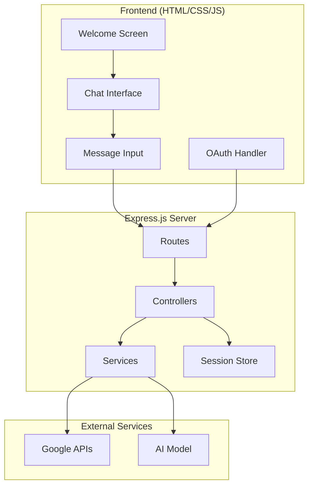
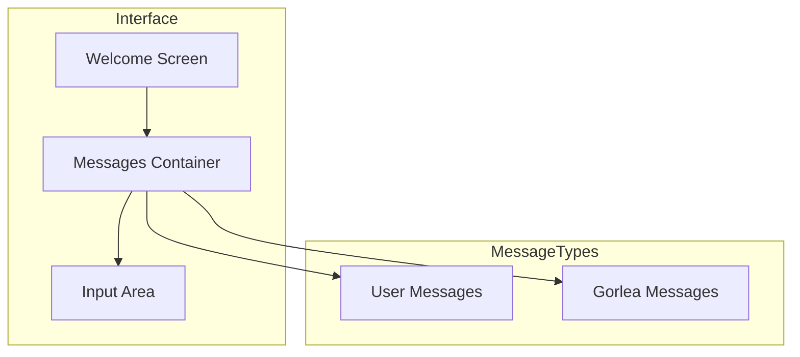
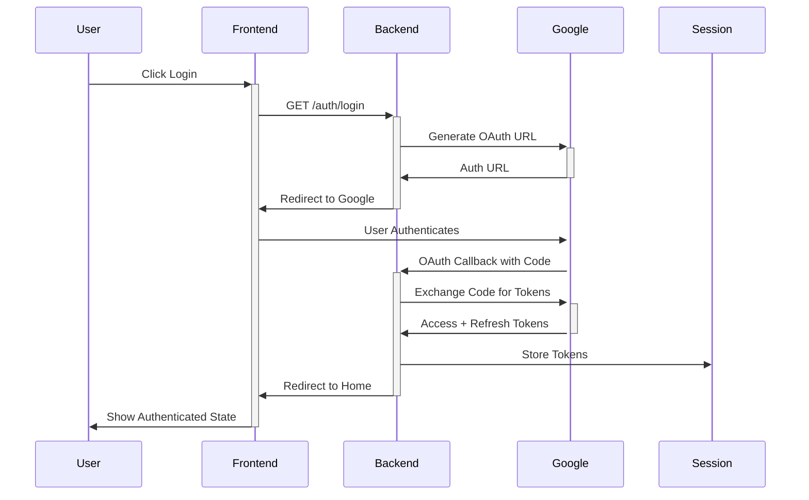
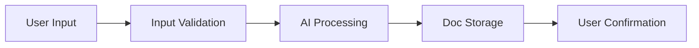
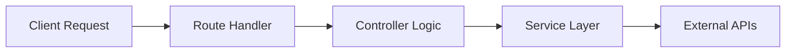
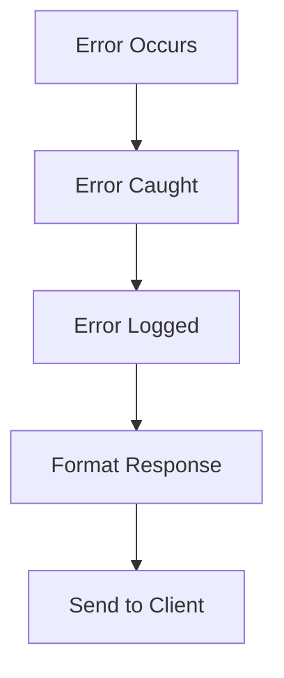

# 🏗 System Patterns: Gorlea Notes

## System Architecture



## Frontend Patterns

### 1. UI Components


### 2. Message Styling Pattern
- Consistent dark theme (#1E1E2E)
- Gold accents for visual hierarchy
- Right-aligned user messages
- Left-aligned Gorlea messages
- Smooth animations and transitions

### 3. Input Pattern
- Auto-expanding textarea
- Character limit handling
- Submit on Enter (Shift+Enter for newline)
- Visual feedback on actions

## Core Design Patterns

### 1. Authentication Pattern


### 2. Note Processing Pattern


### 3. Session Management Pattern
- Express session middleware
- In-memory session store (dev)
- Secure cookie configuration
- Token storage in session

### 4. Security Pattern
- OAuth2 flow with PKCE
- HTTP-only cookies
- Session-based token storage
- Environment variable protection

## Component Organization

### Server Structure
```
server/
├── index.js                 # Entry point
├── routes/                  # Route definitions
│   └── auth.js             # Auth routes
├── controllers/            # Request handlers
│   └── authController.js   # Auth logic
├── config/                # Configuration
│   └── google.js         # OAuth config
```

### Route Patterns
- RESTful design
- Resource-based URLs
- Proper HTTP methods
- Consistent error responses

## Data Flow Patterns

### 1. Request Flow


### 2. Error Handling Flow


### 3. Authentication Flow
1. Client initiates login
2. Redirect to Google OAuth
3. Handle OAuth callback
4. Exchange code for tokens
5. Store tokens in session
6. Maintain user state

## Implementation Guidelines

### Express Server
- Modular routing
- Controller-based logic
- Service layer abstraction
- Middleware composition

### Session Management
- Secure cookie settings
- Token storage strategy
- Session expiration
- Refresh mechanism

### Error Handling
- Consistent error format
- Proper status codes
- Error logging
- User-friendly messages

### Security Measures
- CORS configuration
- Rate limiting
- Input validation
- Token management

## API Patterns

### Authentication Endpoints
- GET /auth/login
- GET /auth/callback
- GET /auth/logout

### Response Format
```json
{
  "success": true,
  "data": {},
  "error": null
}
```

### Error Format
```json
{
  "success": false,
  "data": null,
  "error": {
    "code": "AUTH_ERROR",
    "message": "Authentication failed"
  }
}
```

## Future Considerations

### Scalability
- Session store options
- Rate limiting strategy
- Caching implementation
- Load balancing

### Security Enhancements
- Request validation
- API authentication
- Error masking
- Audit logging

---

These patterns form the foundation of Gorlea Notes' technical implementation, ensuring a robust and maintainable system that delivers on the product's user experience goals.
